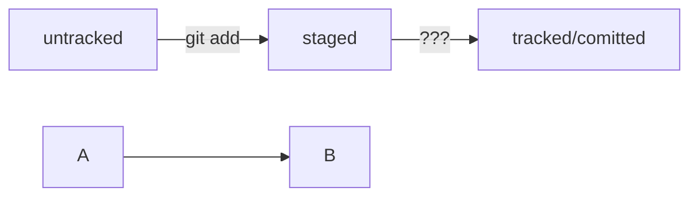

# Работа с Markdown
_______

**Ссылки на полезные материалы в таблице**

Ссылка | Описание
--- | ---
[Шпаргалка по Markdown](https://gist.github.com/fomvasss/8dd8cd7f88c67a4e3727f9d39224a84c "GitHub") | Теория
[Демо страница](https://markdown-here.com/livedemo.html "Markdown Here") | Тренажер
________
### Перейдя по ссылкам можно
* Узнать синтаксис
* Потренироваться на практике

Это очень важно если вы хотите освоить *Markdown*

```bash
touch README.md
```

```mermaid
graph LR;
 untracked -- "git add" --> staged;
 staged    -- "git commit -m"     --> tracked/comitted;
cat HEAD --> cat refs/heads/master;
``` 

Подсказка: как сделать mermaid-схему

Чтобы получить mermaid-схему в README.md, нужно добавить блок кода типа mermaid.

```bash
HEAD -- это голова.
Коммит -- это всему голова.
Статусы файлов:
<тут пустая строка!>
```
Перед блоком и после него нужны пустые строки, иначе GitHub может не понять, что это блок кода.

Два символа %% обозначают в mermaid строку-комментарий.

Чтобы сделать схему, нужно указать формат: graph LR. Graph — это простейший тип схем; для шпаргалки его будет достаточно.
Чтобы добавить элементы и связи (стрелки), используют строки вида A --> B. Такая строка создаст квадратные блоки А и B и соединит их стрелкой.

Дополнительно можно указывать текст на стрелке. Например, так: A -- "text" --> B.
Ниже вы найдёте заготовку для схемы статусов файлов.
